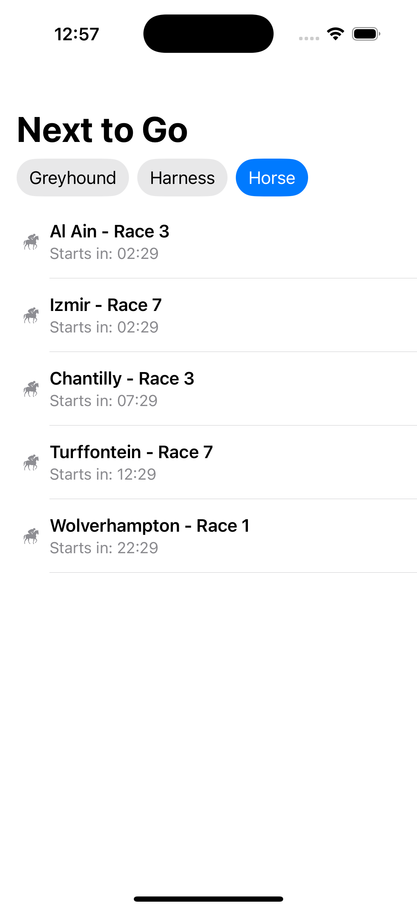

# NextToGo

NextToGo is an iOS application that provides real-time information about upcoming races. Built with SwiftUI, it offers a clean and intuitive interface for users to stay updated with race information.

## Features

- Display upcoming races in real-time
- Clean and modern SwiftUI interface
- MVVM architecture for better code organization
- SwiftLint integration for code quality

## Screenshots

### Horse Racing


### Greyhound Racing


## Requirements

- iOS 18.2
- Xcode 16.2
- Swift 6

## Installation

1. Clone the repository
```bash
git clone https://github.com/yourusername/NextToGo.git
```

2. Open the project in Xcode
```bash
cd NextToGo
open NextToGo.xcodeproj
```

3. Build and run the project

## Project Structure

```
NextToGo/
├── Features/
│   └── NextRaces/
│       ├── Model/
│       │   ├── RaceSummary.swift
│       │   ├── RaceResponse.swift
│       │   ├── RevealedRaceInfo.swift
│       │   ├── RaceCategory.swift
│       │   └── RaceForm.swift
│       ├── View/
│       │   ├── NextRacesView.swift
│       │   ├── RaceRow.swift
│       │   └── FilterButton.swift
│       ├── NextRacesService.swift
│       └── NextRacesViewModel.swift
├── Service/
│   ├── ServiceResponse.swift
│   ├── URLRequestExtension.swift
│   ├── ServiceEndpoints.swift
│   ├── ServiceError.swift
│   └── ServiceRequest.swift
├── SupportingFiles/
│   ├── Assets.xcassets/
│   ├── NextToGoApp.swift
│   └── Constants.swift
└── Preview Content/
```

## Architecture

The project follows the MVVM (Model-View-ViewModel) architecture pattern:
- **Model**: Data models and business logic
- **View**: SwiftUI views and UI components
- **ViewModel**: View models that handle the presentation logic and data transformation

## Testing

The project includes both unit tests and UI tests:
- `NextToGoTests/`: Contains unit tests

## Code Style

This project uses SwiftLint to enforce code style guidelines. The configuration can be found in `.swiftlint.yml`.

## License

This project is licensed under the MIT License - see the LICENSE file for details.
